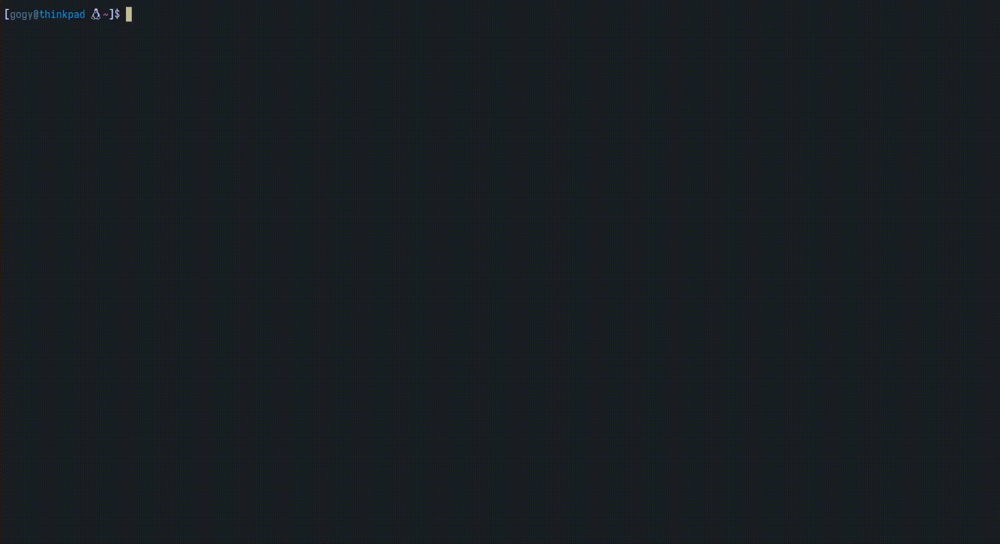

# Termsort

This is a project to show a visual demonstration of how sorting algorithms work, based on the famous video by Timo Bingmann, https://youtu.be/kPRA0W1kECg.



> [!note]
> This program has only been tested on [foot](https://codeberg.org/dnkl/foot) and [kitty](https://sw.kovidgoyal.net/kitty), and may have flickering or other visual artifacts on other terminals.

## Contents

* [Installation](#Install)
* [Algorithms included](#Algorithms)

# Installation
```bash
git clone https://github.com/thegogy/termsort
cd termsort
rm demo.mp4

make clean install
```

By default, this will install the project to your `$HOME/.local/bin` directory. This can be changed by instead running the following command:

```bash
make clean install INSTALL_DIR=/path/to/custom/install/dir
```

This program also includes a graphical interface made with [sdl](https://www.libsdl.org/). To compile with this as the frontend, you may need to install the sdl3 package, which is found in many repos:

```bash
paru -S sdl3-git
```

Then simply change the backend in the flags:
```bash
make clean install BACKEND=sdl
```

# Algorithms

* bogo sort
* bubble sort
* quick sort
* shell sort
* merge sort
* heap sort
* gnome sort
* cocktail sort
* insertion sort
* selection sort
* oddeven sort
* pancake sort
* pigeonhole sort
* comb sort
* stooges ort
* bad sort
* drop sort
* radix sort
* bozo sort
* inplace merge sort


## Todo

- [x] Graphical frontend
  - [ ] Full color support to graphical frontend
  - [ ] Add sounds using sdl
  - [ ] Display stats on graphical frontend

- [ ] More sorting algorithms!!
  - [ ] Bitonic sort
  - [ ] Binary Tree Sort
